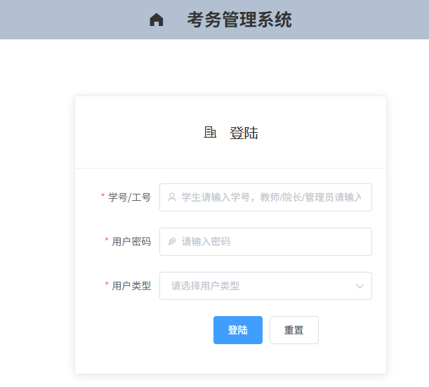
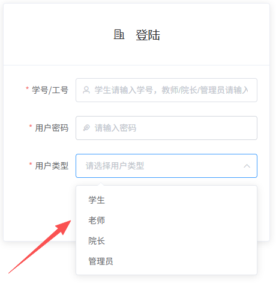
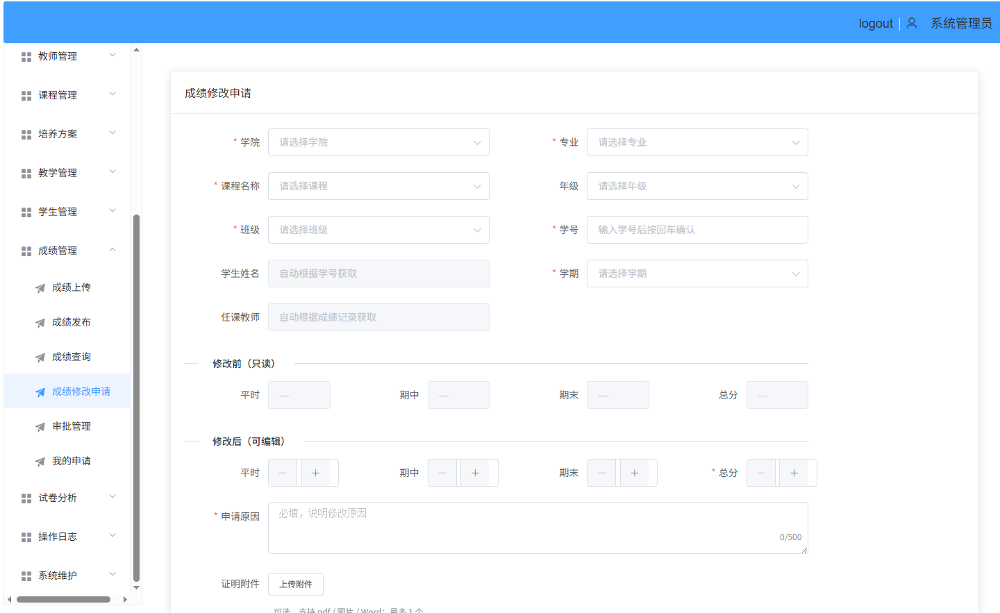

# 学生成绩管理系统

**基于前后端分离的学生成绩管理系统**，采用 Vue + Spring Boot + MyBatis 开发，支持多角色（管理员、院长、教师、学生）管理与动态数据交互。登录使用**学号/工号 + 密码**（学生学号，教师/院长/管理员工号）。

- **仓库地址**：[https://github.com/liqunhua4413/studentms](https://github.com/liqunhua4413/studentms)
- **部署与设计**详见：[Doc/设计方案与部署文档.md](Doc/设计方案与部署文档.md)
- **使用说明**详见：[Doc/用户使用说明文档.md](Doc/用户使用说明文档.md)

---

## 技术架构

| 前端技术栈        | 后端技术栈   |
|-------------------|--------------|
| Vue 2.x           | Spring Boot  |
| Vue Router / Axios| MyBatis      |
| Element UI        | Maven        |
| sessionStorage    | MySQL 8.0.x |

**建议版本**（详见 [设计方案与部署文档](Doc/设计方案与部署文档.md)）：Java JDK 17、Maven 3.6+ / 3.9+、MySQL 8.0.x、Node.js 20.x、Nginx（生产环境）。

---

## 快速部署

部署步骤（数据库初始化、后端编译与启动、前端构建与 Nginx 配置等）请参见：

- **[Doc/设计方案与部署文档.md](Doc/设计方案与部署文档.md)**（含 Linux/Windows 部署流程与配置说明）

简要步骤示例：

1. **初始化数据库**：`mysql -u root -p < mysql/studentms.sql`
2. **后端**：进入 `student_server`，执行 `mvn clean package`，运行 `java -jar target/student_server-0.0.1-SNAPSHOT.jar`（默认端口 10086，context-path `/api`）
3. **前端**：进入 `student_client`，执行 `npm install`，开发环境 `npm run serve`（默认 8080），生产环境 `npm run build` 后将 `dist/*` 部署至 Nginx 等

---

## 文档索引

| 文档 | 说明 |
|------|------|
| [设计方案与部署文档.md](Doc/设计方案与部署文档.md) | 开发者/系统管理员：数据库设计、权限、成绩导入与试卷分析、部署、接口概要、备份与异常处理 |
| [用户使用说明文档.md](Doc/用户使用说明文档.md) | 教师/院长/管理员/学生：登录、成绩上传与下载、试卷分析上传、基本信息录入、操作日志、成绩修改流程与状态说明 |
| [成绩导入说明.md](Doc/成绩导入说明.md) | 成绩单 Excel 格式、字段说明、校验规则与导入顺序 |

---

## 项目截图

### 1. 登录界面

### 2. 用户类型选择

### 3. 系统管理员成绩管理界面

---

## 联系我们

如有问题或建议，可通过以下方式联系：

*扫一扫上方二维码添加为好友*
